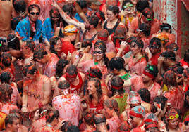
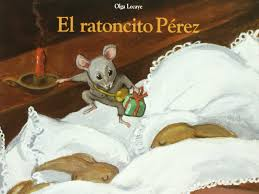

  <h2>Map of Spain</h2>
  
The following displays a map of Spain using tags that describe each region. Click the "+" signs to learn more.

 

 
 
 <iframe src="https://amayazemmanuel.h5p.com/content/1291194067892799907/embed" width="1088" height="637" frameborder="0" allowfullscreen="allowfullscreen" allow="geolocation *; microphone *; camera *; midi *; encrypted-media *"></iframe>

<h1>Fun Facts About Spain</h1>

<li style="font-weight: 400;" aria-level="1">Spain is the 2nd largest country in the EU, coming in second to France the country has an area of about 506,000 kilometres squared including the Canary Islands and the other territories of Spain. It also had the 5th largest population in the whole of Europe, providing a home to 47 million. Barcelona alone has a population of 5.5 million, not to mention Madrid's population of 6.5 million.</li>

&nbsp;

 
<li style="font-weight: 400;" aria-level="1">Spain was not always united; it used to be a collection of regions, in fact, it was the alliance and marriage between Fernando of Aragon and Isabel of Castile that united the kingdom in the fifteenth century.</li>
 

&nbsp;

<li style="font-weight: 400;" aria-level="1">Spanish is the 2nd most spoken language in the world, coming second to Mandarin. Despite Spain being home to other languages for instance Catalan, there are about 440 million native Spanish speakers.</li>

&nbsp;

<li style="font-weight: 400;" aria-level="1">Unlike other countries where nudity would be seen as public indecency, it is completely legal in Spain</li>

&nbsp;

<li style="font-weight: 400;" aria-level="1">The life expectancy of Spanish people is the 2nd highest in the world. Coming 2nd to the Japanese. Spanish people are expected to live to 83. Looking deeper into the statistics Spanish women outlive their men by a couple years, with their expectancy being 85 compared to the men's 79.</li>

&nbsp;

<li style="font-weight: 400;" aria-level="1">In Spanish culture, religion bears significant importance but according to statistics, only 13.6 per cent of the community goes to church every week. The image shows the Sagrada Familia Cathedral in Spain.</li>

&nbsp;

<li style="font-weight: 400;" aria-level="1">The Spanish royal family are a symbol of persistence and unity for Spain, a constitutional monarchy.</li>

&nbsp;

<li style="font-weight: 400;" aria-level="1">Spain is home to the 2nd highest unemployment rate in the whole of Europe, coming second to Greece, however, it is gradually decreasing.</li>

&nbsp;

<li style="font-weight: 400;" aria-level="1">Despite visitors seeing Paella as a national dish, the locals consider it a Valencian one.</li>

&nbsp;

<li style="font-weight: 400;" aria-level="1">Spain is filled with opportunities and since 2008 while the Global Financial Crisis was going on female entrepreneurs managed to start up about 40 percent of the new businesses, which in turn dramatically helped the economy while also giving them a new outlook on life.¡Podemos hacerlo!</li>

  

&nbsp;

<li style="font-weight: 400;" aria-level="1">Don Quixote written by Miguel de Cervantes in 1605 is considered the first modern novel ever written and is notably one of the most imperative pieces of Spanish literature written in the Spanish and Western literature worlds.</li>

  

&nbsp;

 

<li style="font-weight: 400;" aria-level="1">In the La Tomatina festival every year in August, after squashing the tomatoes everyone is cheered to throw as many tomatoes as they can and according to the statistics, this is roughly 150,000 a year.</li>

  

&nbsp;

<li style="font-weight: 400;" aria-level="1">Instead of the tooth fairy, Hispanic people believe in Ratoncito Pérez, who is a mouse with magical powers. The concepts are the same where the children would put the tooth under the pillow and receive money or a small gift for it the next day.</li>
 

  

&nbsp;

<li style="font-weight: 400;" aria-level="1">Guinness World Records has given the title of the oldest restaurant in the world to the Restaurante Botín, which has been open since 1725 and its special dish is roast suckling pig.</li>
 

  

&nbsp;

<li style="font-weight: 400;" aria-level="1">According to the statistics in 2018, Spain was the 2nd most visited place with 82.8 million tourists, coming 2nd to France.</li>
 

  

&nbsp;

<li style="font-weight: 400;" aria-level="1">The biggest lottery in the world is held just before Christmas in Spain and is called El Gordo meaning the "Big One" it had the prize of €2.24 billion in 2019.</li>
 

  

&nbsp;

<li style="font-weight: 400;" aria-level="1">Spain loves football, La Roja has been at the top of FIFA's world ranking and have won the 2010 World Cup along with championships in Europe in 2008 and 12.</li>

